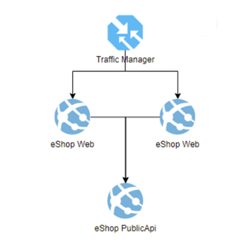

# Azure infrastructure

## Simple schema



## App Service eShopOnWeb Web

Web 1 - West Europe, F1 , autoscaling, 2 slots, deployment local git

Web 2 - North Europe, S1, deployment local git

PublicApp - West Europe, F1, deployment local git

## Azure Trafic Manager

Priority, Main endpoint - Web 1, Failover Web 2

## DatabaseInMemory

"UseOnlyInMemoryDatabase": true

## Azure CLI

```PS console
az deployment sub create --name depl00001 --template-file main.bicep --location westeurope --parameters aspSku=F1 createStagingSlot=false
$webZip = .\dotnet_publish_web.ps1 -project "./src/Web/Web.csproj" -projectName "Web"
az webapp deploy --resource-group <group-name> --name <app-name> --src-path <filename>.zip
```

az deployment group create --name deplapp003 -g rg-web-and-api-mzir5dovdhbr6 --template-file deploy_app.bicep --parameters appServiceName=api-vivethere-mzir5dovdhbr6.azurewebsites.net

<https://blog.dotnetstudio.nl/posts/2021/04/merge-appsettings-with-bicep/>

<https://learn.microsoft.com/en-us/azure/azure-resource-manager/bicep/bicep-functions-resource>

<https://learn.microsoft.com/en-us/azure/app-service/reference-app-settings?tabs=kudu%2Cdotnet>

<https://learn.microsoft.com/en-us/azure/app-service/deploy-run-package>

dotnet build ./src/Web/Web.csproj -c Release -o ./Out/WebBuild
cd ./Out/WebBuild
Compress-Archive -Path * -DestinationPath webdeploy.zip

k6
docker run --rm -v C:\Users\vadym\source\repos\eShopOnWeb\myinfra:/app -w /app grafana/k6 new mytest.js
docker run --rm -i grafana/k6 run - <mytest.js

.\lab_monitoring.ps1 C:\Users\Vadym_Tarasov\source\repos\eShopOnWeb

## AppService Traning

1. Open cmd and change dir to dir_to_your_repo\eShopOnWeb

   ```Console
   cd dir_to_your_repo\eShopOnWeb
   ```

2. Open VS Code from here

   ```Console
   code .
   ```

3. Use Terminal PowerShell Extension in VS Code and login into Azure with your account

   ```Console
   az login --use-device-code
   ```

4. Change dir

    ```Console
     cd .\myinfra\
    ```

5. This ps1 takes  <dir_to_your_repo>\eShopOnWeb as parameter

    ```Console
     .\main.ps1 <dir_to_your_repo>\eShopOnWeb
    ```

6. Two resource groups will be created:

  ```Text
   rg-web-RANDOM :

     Traffic manager - http://tmvivethereXXXXXXXXXXXXXXX.trafficmanager.net
     Priority endpoints.
     Plan S1  
     AppService WebUI -> Main UI

   rg-web-and-api-RANDOM

     api-vivethere-RANDOM -> PublicApi
     Plan S1
     webapp-failover-vivethere-RANDOM -> Failover WebUI
     Plan S1
  ```

8. List resource groups

  ```Console
    az group list -o table
  ```

9. Delete resource group

  ```Console
    az group delete --name rg-web-RANDOM --no-wait --yes
    az group delete --name rg-web-and-api-RANDOM --no-wait --yes
    az group list -o table
  ```
